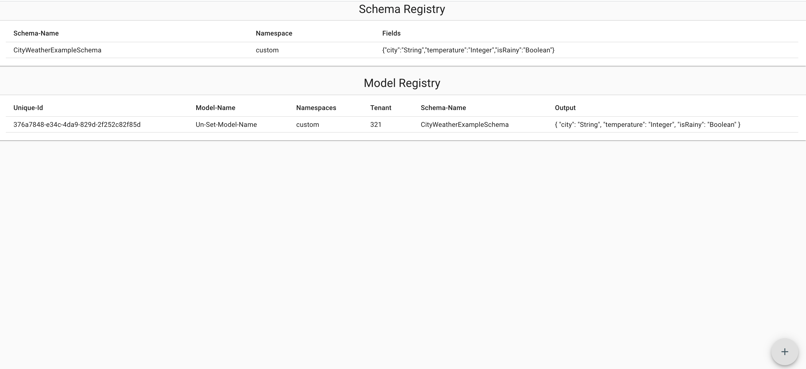

# json-schema-editor

Create Schema Definitions and implement models with their values. According to the standard of http://json-schema.org/

  

## Useful for people, who

...create JSON APIs
...create Forms
...create Schema Definitions

## Electron App

You can build an electron app for Win, Mac and Linux.

## Thanks to:

http://json-schema.org/

Amazing work of:

https://github.com/rjsf-team/react-jsonschema-form
