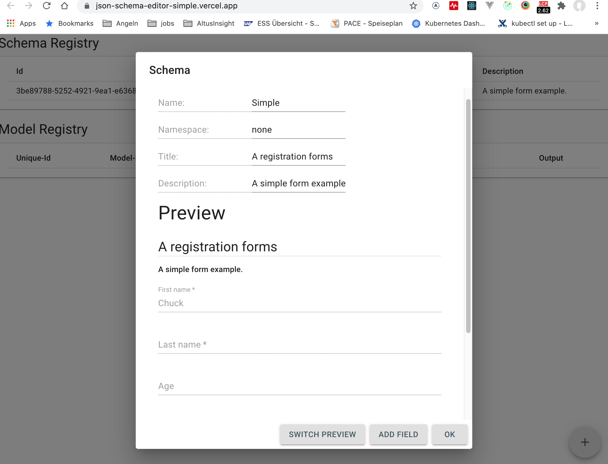

# json-schema-editor

Create Schema Definitions and implement models with their values. According to the standard of http://json-schema.org/

## Live Demo

https://json-schema-editor-simple.vercel.app/

  

## Useful for people, who

...create JSON APIs
...create Forms
...create Schema Definitions
...handling of Schemas in a Registry
...handling of Data Models, derived from the Schema in a Registry

## Features

- JSON Schema Compliant
- Preview for the Form-View and Editor-View
- JSON Editor taken from VSCode Engine (all features like real time validation, Copy and Paste supported)
- Implement Models for your JSON Schemas
- Registry for Schemas and Models available

### Form View

  

### Editor View

  

## Electron App

You can build an electron app for Win, Mac and Linux by dropping yarn build into your cli.

## Thanks to:

http://json-schema.org/

Amazing work of:

https://github.com/rjsf-team/react-jsonschema-form
